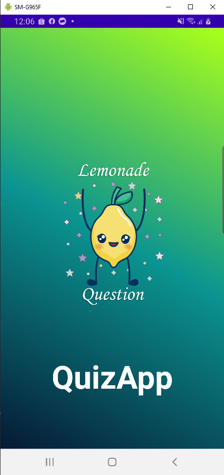
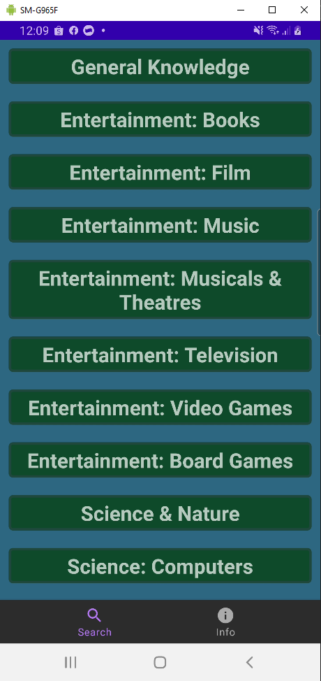
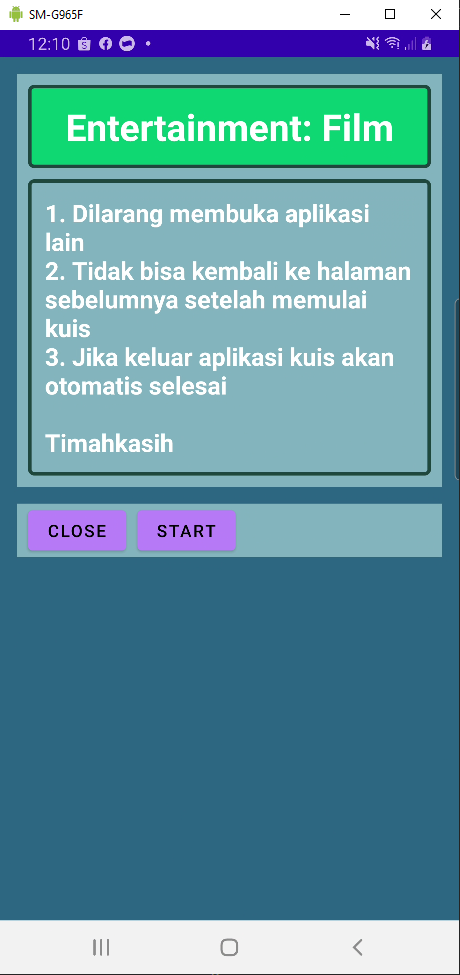
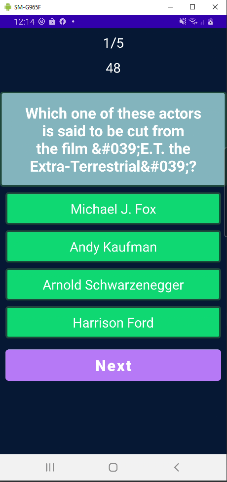
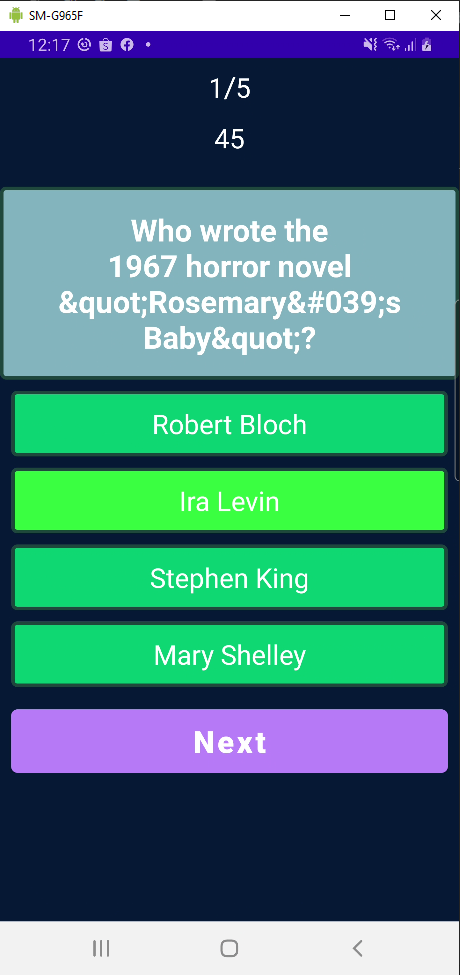
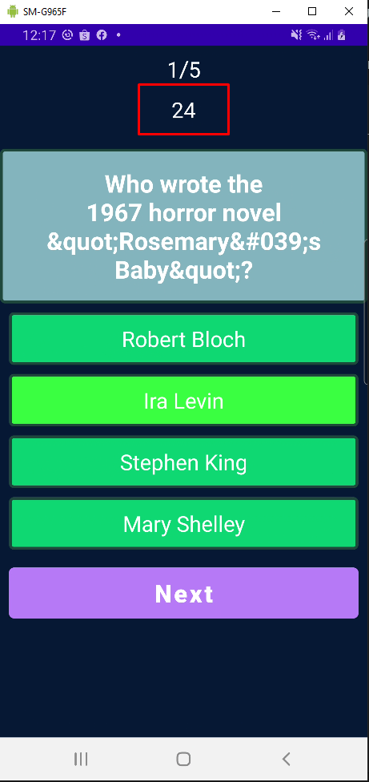
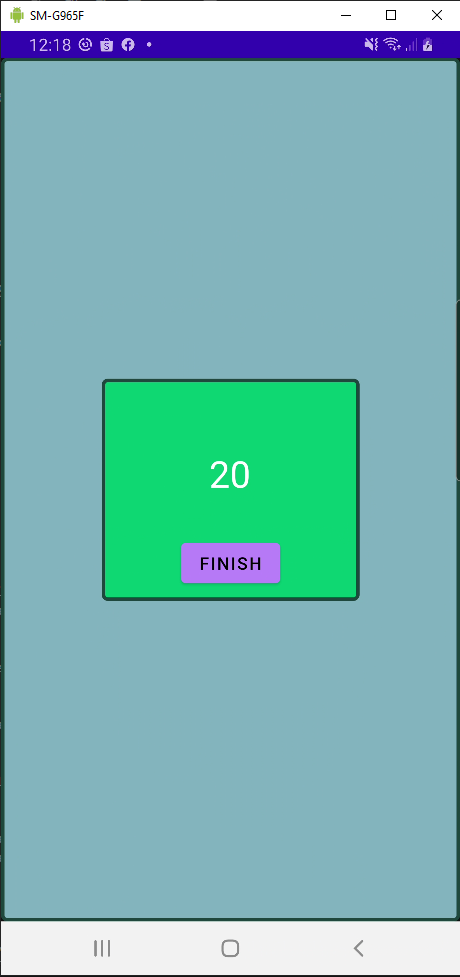

# 10 - Proyek

## Lemonade Quiz

    Sebuah aplikasi quiz android dengan fitur auto finish jika keluar atau berganti layar

## Deskripsi Aplikasi

    Dibuatnya aplikasi “Lemonade Quiz“  ini bertujuan untuk membantu para pelajar maupun pengajar dalam mengerjakan soal untuk meminimalisir terjadinya kecurangan dan gangguan.

## Indentitas Pengembang (Developer)

    Dikembangkan Oleh :
    Rizal Anhari (1841720218)
    Agustus 2020 - Desember 2020

## Fitur-fitur Aplikasi

|  |  |
|--|--|
| Splash Screen :  |   |
| Recycle View Category : |   |
| Rule Activity : |   |
| Quiz Activity : |   |
| Change the Radiobutton Background Color When Selected |   |
| Countdown and Auto Finish If It Runs Out  |   |
| Score Activity|   |
| Auto Finish If Switch Screen |  |

## Saran

    1. Game Mode sehingga tidak ada gangguan dari luar
    4. Interactive UI
    5. Database Score & User

## Kesimpulan

    Dengan mengerjakan proyek ini membuat saya belajar tentang retrofit, activity lifecycle dan juga desain xml lebih dalam dan semoga ilmu ini berguna kemudian hari

## Sumber Data/Referensi

    1. https://opentdb.com/
    2. https://stackoverflow.com/
    3. https://www.youtube.com/watch?v=CqHh6aX0RnQ&list=PLnfB3OWST3K3lCSi_YUrBujaAs0bFt4tz
    4. https://www.youtube.com/channel/UC5c97OEjuxs1q00dRfCc9zw