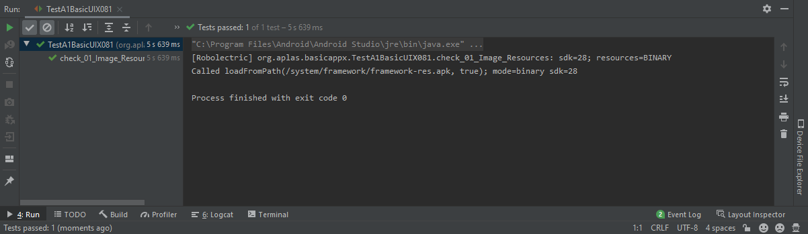

# Laporan Praktikum #12 - Java API

## Tujuan Pembelajaran

1. Students know how to start an Android Studio Project with blank layout.
2. Students know how to configure Android Studio project resources, like string and font.
3. Students know how to design basic layout, add TextView, and add a Button.
4. Students know how to make Space and add Child Layout.
5. Students know how to configure color resources, make EditText, and Spinner.
6. Students know how to make CheckBox.
7. Students know how to make RadioGroup and RadioButton.
8. Students know how to add image resource and make an ImageView.
9. Students know how to add drawable resource and make a Table.

## Percobaan

### Guide 1

`Screenshot:`

### Guide 2

`Screenshot:`

### Guide 3

`Screenshot:`

### Guide 4

`Screenshot:`

### Guide 5

`Screenshot:`

### Guide 6

`Screenshot:`

### Guide 7

`Screenshot:`

### Guide 8

`Screenshot:`

### Guide 9

`Screenshot:`

## Kode Program

[BasicAppx](../../src/02_layout/BasicAppX)

## Kesimpulan

Mengetahu cara membuat layout pada android studio

## Pernyataan Diri

Saya menyatakan isi tugas, kode program, dan laporan praktikum ini dibuat oleh saya sendiri. Saya tidak melakukan plagiasi, kecurangan, menyalin/menggandakan milik orang lain.

Jika saya melakukan plagiasi, kecurangan, atau melanggar hak kekayaan intelektual, saya siap untuk mendapat sanksi atau hukuman sesuai peraturan perundang-undangan yang berlaku.

Ttd,

***Rizal Anhari***