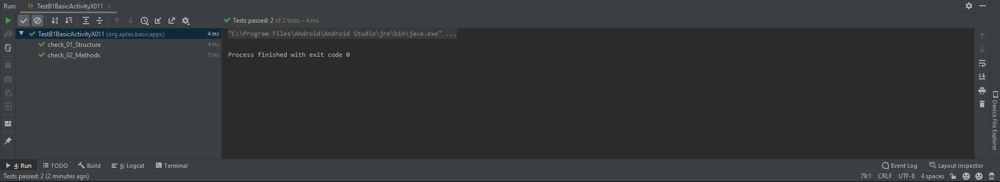
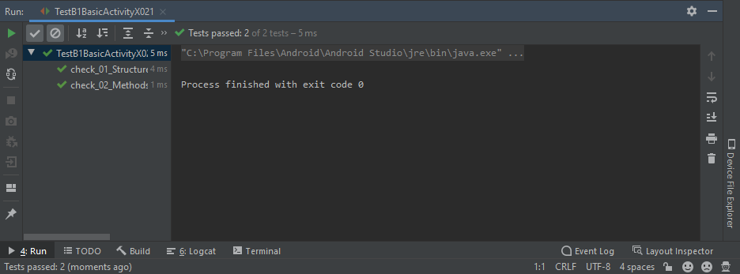
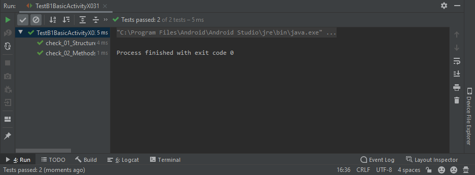
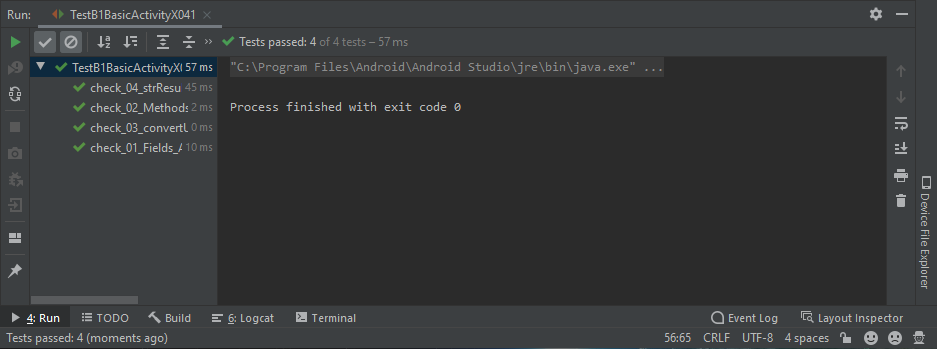
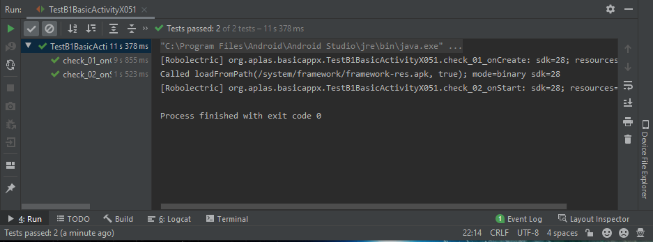
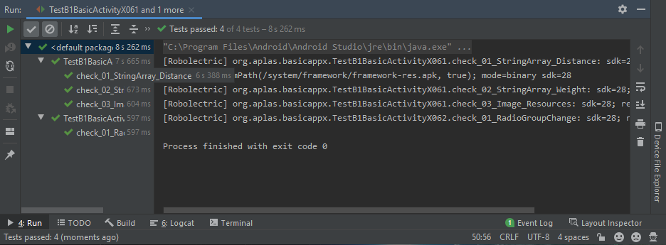
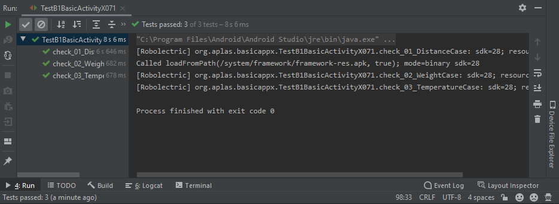
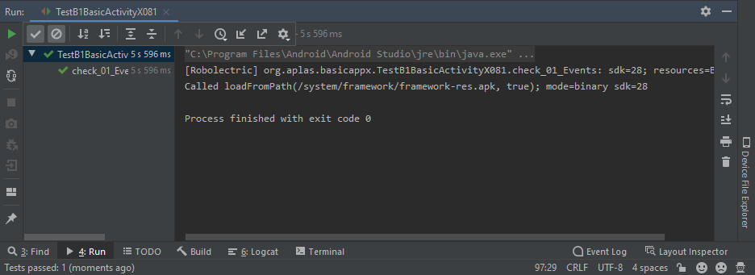
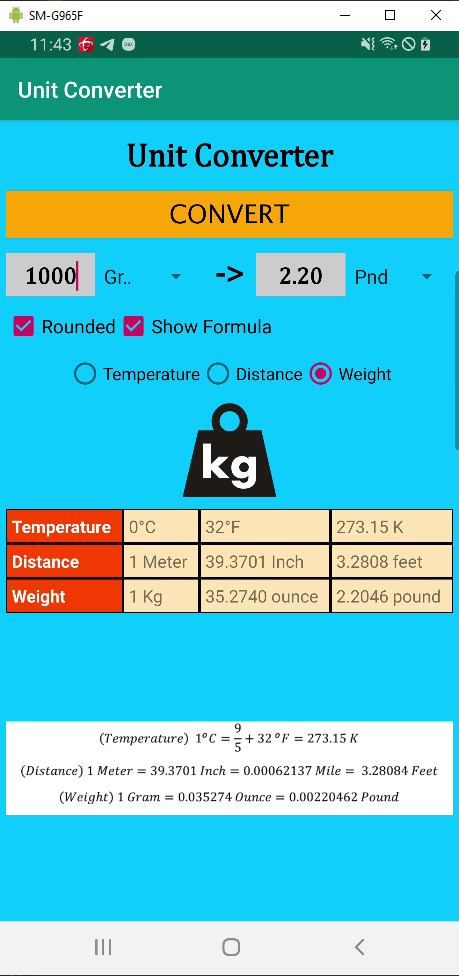

# Laporan Praktikum #03 - Activity

## Tujuan Pembelajaran

1. Students create a Temperature class to convert unit.
2. Students create a Distance class to convert unit.
3. Students create a Weight class to convert unit.
4. Students can make fields and methods in main activity class.
5. Students understand about activity lifecycle when on Create and on Start.
6. Students understand about RadioGroup changed event and how to change Spinner content.
7. Students create a method to do conversion.
8. Make some events action for Button, Spinner, and CheckBox.
9. Students create a new image element and fill it when formula checkbox checked.

## Percobaan

### Guide 1

`Screenshot:`

### Guide 2

`Screenshot:`

### Guide 3

`Screenshot:`

### Guide 4

`Screenshot:`

### Guide 5

`Screenshot:`

### Guide 6

`Screenshot:`

### Guide 7

`Screenshot:`

### Guide 8

`Screenshot:`

### Guide 9

`Screenshot:`

## Hasil & Kode Program

[Source Code BasicAppx](../../src/03_activity/BasicAppX)

## Kesimpulan

Mengetahu cara membuat layout pada android studio

## Pernyataan Diri

Saya menyatakan isi tugas, kode program, dan laporan praktikum ini dibuat oleh saya sendiri. Saya tidak melakukan plagiasi, kecurangan, menyalin/menggandakan milik orang lain.

Jika saya melakukan plagiasi, kecurangan, atau melanggar hak kekayaan intelektual, saya siap untuk mendapat sanksi atau hukuman sesuai peraturan perundang-undangan yang berlaku.

Ttd,

***Rizal Anhari***
