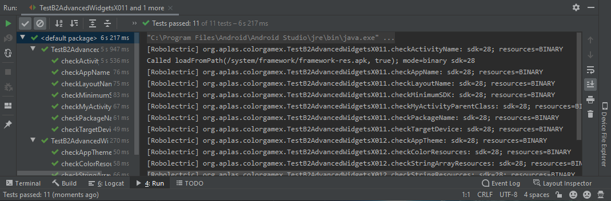
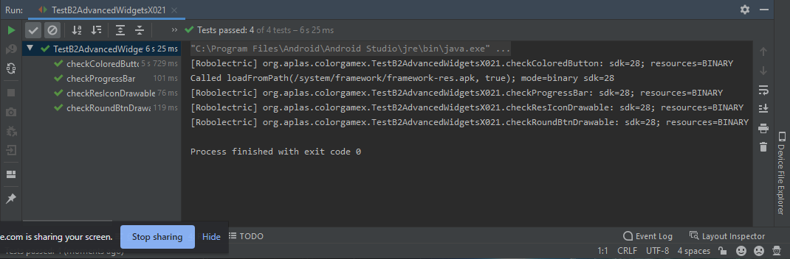
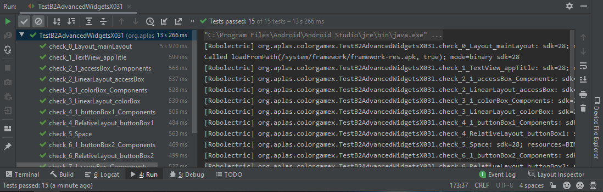
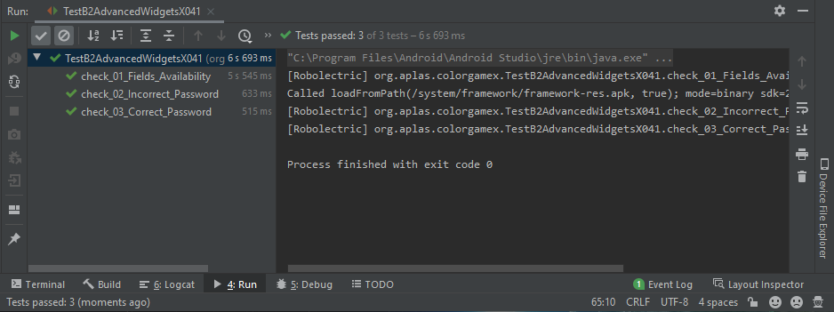
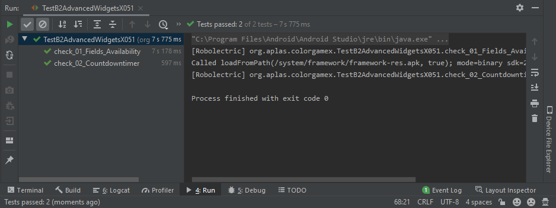
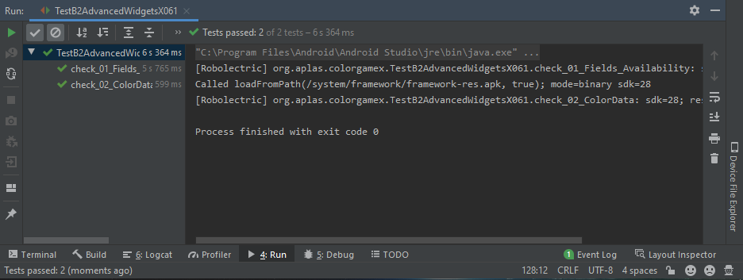
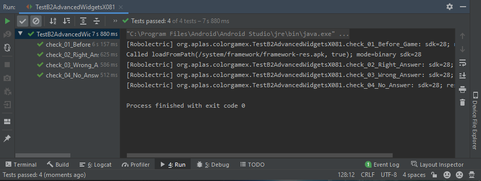

# Laporan Praktikum #03 - Activity

## Tujuan Pembelajaran

## Percobaan

### Guide 1

`Screenshot:`

### Guide 2

`Screenshot:`

### Guide 3

`Screenshot:`

### Guide 4

`Screenshot:`

### Guide 5

`Screenshot:`

### Guide 6

`Screenshot:`

### Guide 7

`Screenshot:`

### Guide 8

`Screenshot:`

## Hasil & Kode Program

[Source Code BasicAppx](../../src/04_advanced_widgets/ColorGameX)

## Kesimpulan

## Pernyataan Diri

Saya menyatakan isi tugas, kode program, dan laporan praktikum ini dibuat oleh saya sendiri. Saya tidak melakukan plagiasi, kecurangan, menyalin/menggandakan milik orang lain.

Jika saya melakukan plagiasi, kecurangan, atau melanggar hak kekayaan intelektual, saya siap untuk mendapat sanksi atau hukuman sesuai peraturan perundang-undangan yang berlaku.

Ttd,

***Rizal Anhari***
