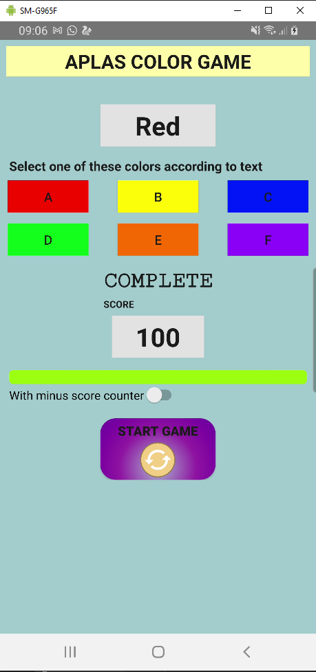

# Laporan Praktikum #03 - Activity

## Tujuan Pembelajaran

1. Student will start the project to create simple game Android application. First with project configuration and resource configuration.
2. Student will understand about style, theme, and drawable vector image.
3. Student will make the UI for project of Color Game with some onClick attribute.
4. Student will declare fields needed by application and define method to check validity to enter the game.
5. Student will understand how Countdowntimer works
6. Student will understand how access array from resource and put it into List and Hashtable.
7. Student will understand how start the timer to start the game.
8. Student will understand how to handle timer and calculate the score.

## Percobaan

### Guide 1

`Screenshot:`

### Guide 2

`Screenshot:`

### Guide 3

`Screenshot:`

### Guide 4

`Screenshot:`

### Guide 5

`Screenshot:`

### Guide 6

`Screenshot:`

### Guide 7

`Screenshot:`

### Guide 8

`Screenshot:`

## Hasil & Kode Program

[Source Code BasicAppx](../../src/04_advanced_widgets/ColorGameX)

## Kesimpulan

## Pernyataan Diri

Saya menyatakan isi tugas, kode program, dan laporan praktikum ini dibuat oleh saya sendiri. Saya tidak melakukan plagiasi, kecurangan, menyalin/menggandakan milik orang lain.

Jika saya melakukan plagiasi, kecurangan, atau melanggar hak kekayaan intelektual, saya siap untuk mendapat sanksi atau hukuman sesuai peraturan perundang-undangan yang berlaku.

Ttd,

***Rizal Anhari***
