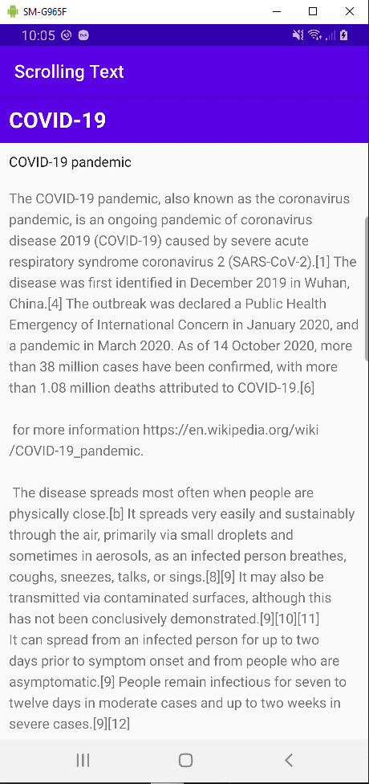
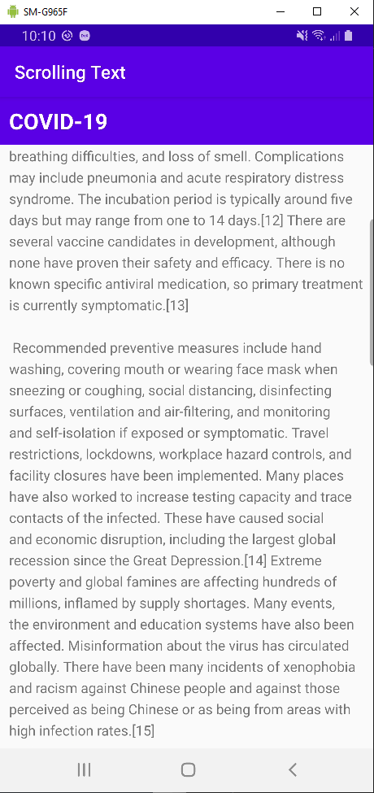
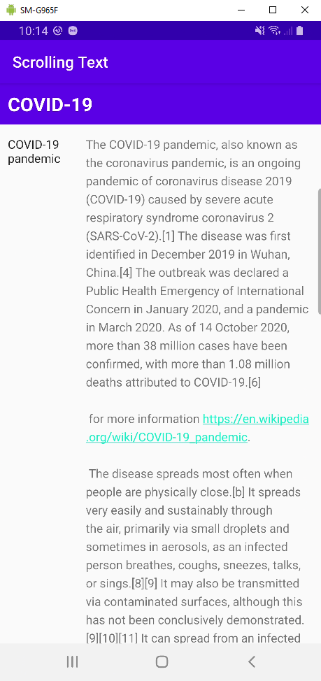

# Laporan Praktikum #05 - Text and scrolling views

## Tujuan Pembelajaran

1. How to use XML code to add multiple TextView elements.
2. How to use XML code to define a scrolling View.
3. How to display free-form text with some HTML formatting tags.
4. How to style the TextView background color and text color.
5. How to include a web link in the text.

## Percobaan

### Task 1: Add and edit TextView elements

```activity_main.xml
<?xml version="1.0" encoding="utf-8"?>
<RelativeLayout xmlns:android="http://schemas.android.com/apk/res/android"
   xmlns:tools="http://schemas.android.com/tools"
   android:layout_width="match_parent"
   android:layout_height="match_parent"
   tools:context="com.example.android.scrollingtext.MainActivity">

   <TextView
      android:layout_width="match_parent"
      android:layout_height="wrap_content"
      android:id="@+id/article_heading"
      android:background="@color/colorPrimary"
      android:padding="@dimen/padding_regular"
      android:text="@string/article_title"
      android:textAppearance=
                  "@android:style/TextAppearance.DeviceDefault.Large"
      android:textColor="@android:color/white"
      android:textStyle="bold" />

   <TextView
      android:layout_width="match_parent"
      android:layout_height="wrap_content"
      android:id="@+id/article_subheading"
      android:layout_below="@id/article_heading"
      android:padding="@dimen/padding_regular"
      android:text="@string/article_subtitle"
      android:textAppearance=
                  "@android:style/TextAppearance.DeviceDefault" />

   <TextView
      android:layout_width="wrap_content"
      android:layout_height="wrap_content"
      android:id="@+id/article"
      android:layout_below="@id/article_subheading"
      android:lineSpacingExtra="@dimen/line_spacing"
      android:padding="@dimen/padding_regular"
      android:text="@string/article_text" />

</RelativeLayout>
```

`Screenshot:`



### Task 2: Add a ScrollView and an active web link

```activity_main.xml
<RelativeLayout xmlns:android="http://schemas.android.com/apk/res/android"
    xmlns:tools="http://schemas.android.com/tools"
    android:layout_width="match_parent"
    android:layout_height="match_parent"
    tools:context=".MainActivity">

    <TextView
        android:id="@+id/article_heading"
        android:layout_width="match_parent"
        android:layout_height="wrap_content"
        android:background="@color/colorPrimary"
        android:padding="@dimen/padding_regular"
        android:text="@string/article_title"
        android:textAppearance=
            "@android:style/TextAppearance.DeviceDefault.Large"
        android:textColor="@android:color/white"
        android:textStyle="bold" />

    <TextView
        android:id="@+id/article_subheading"
        android:layout_width="match_parent"
        android:layout_height="wrap_content"
        android:layout_below="@id/article_heading"
        android:padding="@dimen/padding_regular"
        android:text="@string/article_subtitle"
        android:textAppearance=
            "@android:style/TextAppearance.DeviceDefault" />

    <ScrollView
        android:layout_width="wrap_content"
        android:layout_height="wrap_content"
        android:layout_below="@id/article_subheading">

        <TextView
            android:id="@+id/article"
            android:layout_width="wrap_content"
            android:layout_height="wrap_content"
            android:autoLink="web"
            android:lineSpacingExtra="@dimen/line_spacing"
            android:padding="@dimen/padding_regular"
            android:text="@string/article_text" />

    </ScrollView>

</RelativeLayout>
```

`Screenshot:`


### Task 3: Scroll multiple elements

```activity_main.xml
<?xml version="1.0" encoding="utf-8"?>
<RelativeLayout xmlns:android="http://schemas.android.com/apk/res/android"
    xmlns:tools="http://schemas.android.com/tools"
    android:layout_width="match_parent"
    android:layout_height="match_parent"
    tools:context=".MainActivity">


    <TextView
        android:id="@+id/article_heading"
        android:layout_width="match_parent"
        android:layout_height="wrap_content"
        android:background="@color/colorPrimary"
        android:padding="@dimen/padding_regular"
        android:text="@string/article_title"
        android:textAppearance="@android:style/TextAppearance.DeviceDefault.Large"
        android:textColor="@android:color/white"
        android:textStyle="bold" />

    <ScrollView
        android:layout_width="wrap_content"
        android:layout_height="wrap_content"
        android:layout_below="@id/article_heading">

        <LinearLayout
            android:layout_width="match_parent"
            android:layout_height="wrap_content"
            android:orientation="vertical">

            <TextView
                android:id="@+id/article_subheading"
                android:layout_width="100dp"
                android:layout_height="wrap_content"
                android:padding="@dimen/padding_regular"
                android:text="@string/article_subtitle"
                android:textAppearance="@android:style/TextAppearance.DeviceDefault" />

            <TextView
                android:id="@+id/article"
                android:layout_width="wrap_content"
                android:layout_height="wrap_content"
                android:autoLink="web"
                android:lineSpacingExtra="@dimen/line_spacing"
                android:padding="@dimen/padding_regular"
                android:text="@string/article_text" />

        </LinearLayout>

    </ScrollView>

</RelativeLayout>
```

`Screenshot:`



### Coding challenge

```activity_main.xml
<?xml version="1.0" encoding="utf-8"?>
<RelativeLayout xmlns:android="http://schemas.android.com/apk/res/android"
    xmlns:tools="http://schemas.android.com/tools"
    android:layout_width="match_parent"
    android:layout_height="match_parent"
    tools:context=".MainActivity">


    <TextView
        android:id="@+id/article_heading"
        android:layout_width="match_parent"
        android:layout_height="wrap_content"
        android:background="@color/colorPrimary"
        android:padding="@dimen/padding_regular"
        android:text="@string/article_title"
        android:textAppearance="@android:style/TextAppearance.DeviceDefault.Large"
        android:textColor="@android:color/white"
        android:textStyle="bold" />

    <ScrollView
        android:layout_width="wrap_content"
        android:layout_height="wrap_content"
        android:layout_below="@id/article_heading">

        <LinearLayout
            android:layout_width="match_parent"
            android:layout_height="wrap_content"
            android:orientation="vertical">

            <TextView
                android:id="@+id/article_subheading"
                android:layout_width="100dp"
                android:layout_height="wrap_content"
                android:padding="@dimen/padding_regular"
                android:text="@string/article_subtitle"
                android:textAppearance="@android:style/TextAppearance.DeviceDefault" />

            <TextView
                android:id="@+id/article"
                android:layout_width="wrap_content"
                android:layout_height="wrap_content"
                android:autoLink="web"
                android:lineSpacingExtra="@dimen/line_spacing"
                android:padding="@dimen/padding_regular"
                android:text="@string/article_text" />

            <Button
                android:id="@+id/comment_button"
                android:layout_width="150dp"
                android:layout_height="50dp"
                android:text="@string/add_comment"/>

        </LinearLayout>

    </ScrollView>

</RelativeLayout>
```

`Screenshot:`


### Homework

```activity_main.xml
<LinearLayout
    android:layout_width="match_parent"
    android:layout_height="wrap_content"
    android:orientation="horizontal">

</LinearLayout>
```

`Screenshot:`



## Kesimpulan

Mengetahu cara membuat scroll view

## Pernyataan Diri

Saya menyatakan isi tugas, kode program, dan laporan praktikum ini dibuat oleh saya sendiri. Saya tidak melakukan plagiasi, kecurangan, menyalin/menggandakan milik orang lain.

Jika saya melakukan plagiasi, kecurangan, atau melanggar hak kekayaan intelektual, saya siap untuk mendapat sanksi atau hukuman sesuai peraturan perundang-undangan yang berlaku.

Ttd,

***Rizal Anhari***
