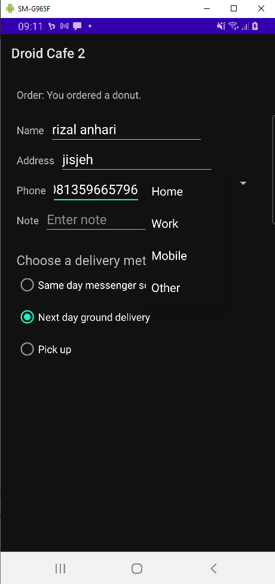
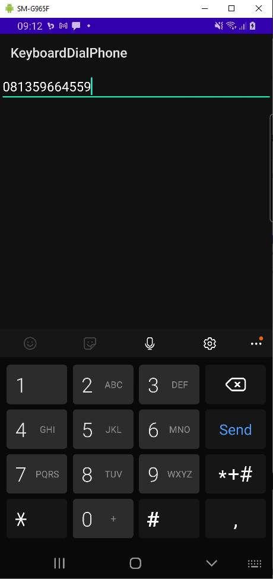
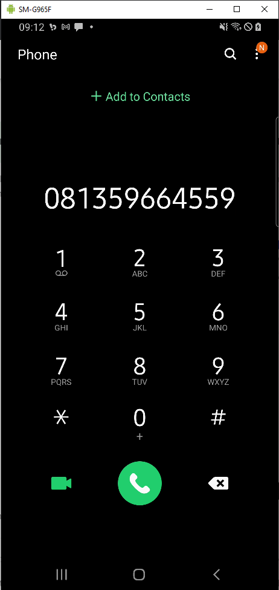
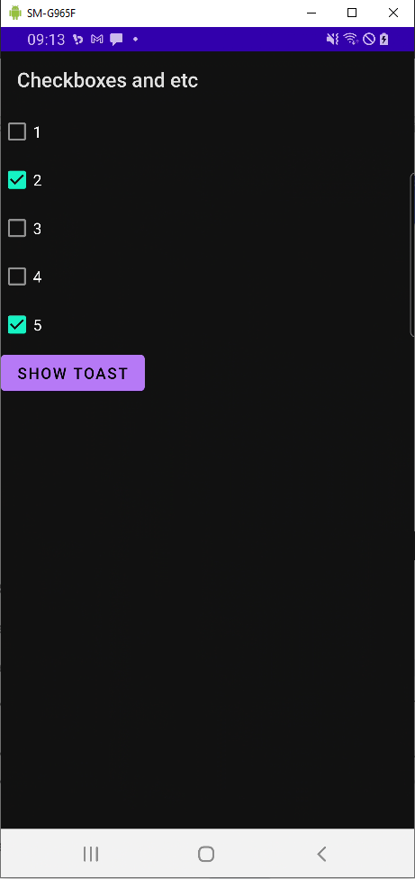

# Laporan Praktikum #6 - Input Control

## Tujuan Pembelajaran

1. How to change the input methods to enable suggestions, auto-capitalization, and password obfuscation.
2. How to change the generic on-screen keyboard to a phone keypad or other specialized keyboards.
3. How to add radio buttons for the user to select one item from a set of items.
4. How to add a spinner to show a drop-down menu with values, from which the user can select one.

## Percobaan

### Task: Input Control

`Screenshot:`

### Coding challenge

`Screenshot:`

### Homework

`Screenshot:`

## Kesimpulan

Mengetahu cara membuat Input Control

## Pernyataan Diri

Saya menyatakan isi tugas, kode program, dan laporan praktikum ini dibuat oleh saya sendiri. Saya tidak melakukan plagiasi, kecurangan, menyalin/menggandakan milik orang lain.

Jika saya melakukan plagiasi, kecurangan, atau melanggar hak kekayaan intelektual, saya siap untuk mendapat sanksi atau hukuman sesuai peraturan perundang-undangan yang berlaku.

Ttd,

***Rizal Anhari***
