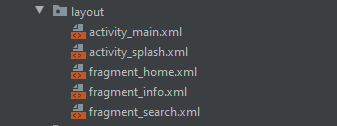
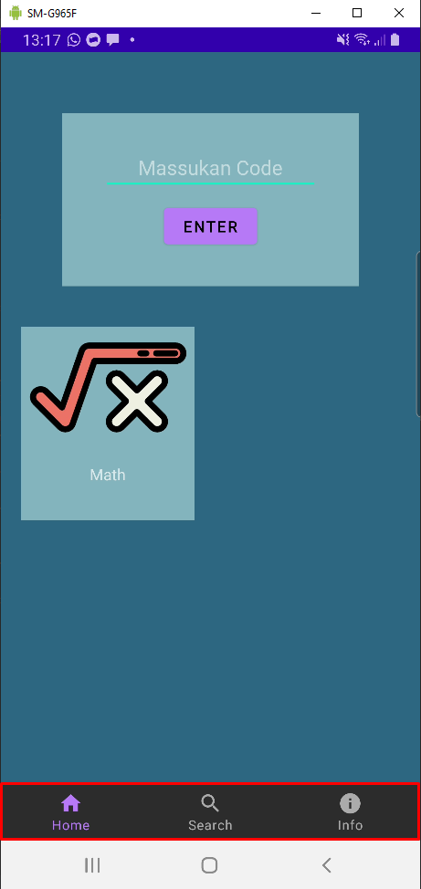
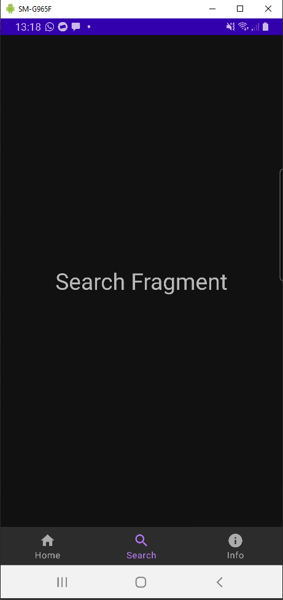
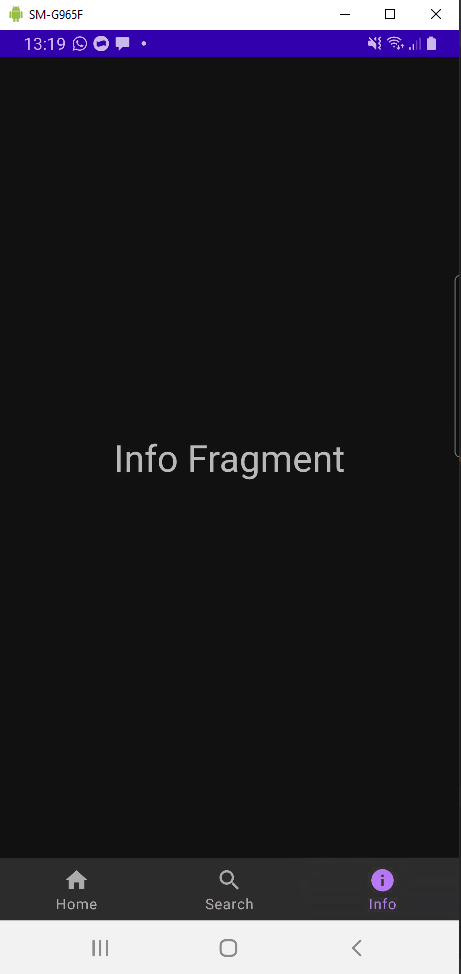
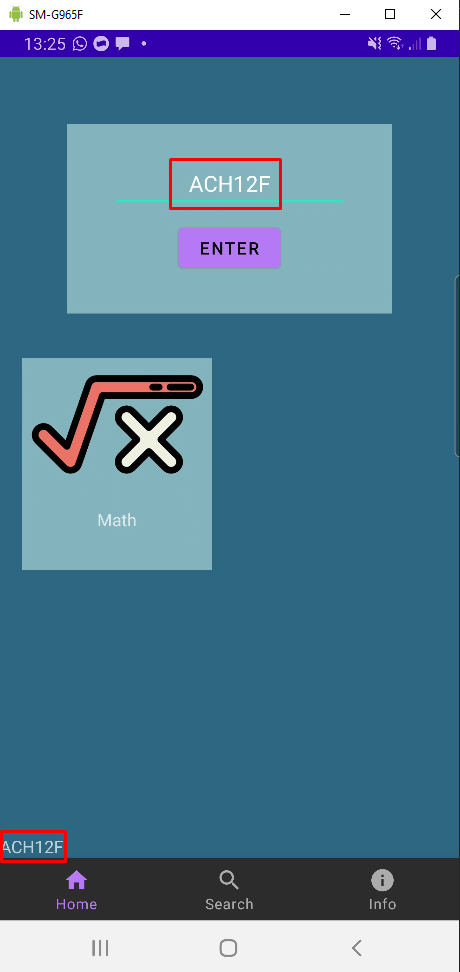
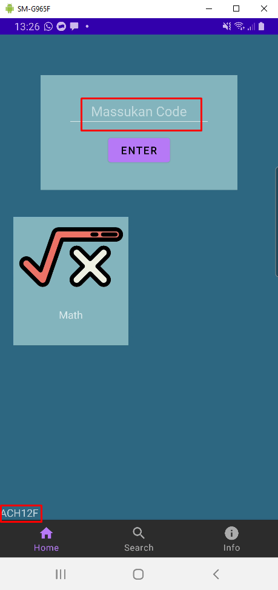

# Laporan Praktikum #08 - View Model

## Task

### Task: Data Binding

```fragmen_home.xml
<?xml version="1.0" encoding="utf-8"?>
<layout xmlns:android="http://schemas.android.com/apk/res/android"
    xmlns:tools="http://schemas.android.com/tools">

    <data>
        <variable
            name="codeViewModel"
            type="com.example.quizapp.viewmodels.CodeViewModels" />
    </data>

    <RelativeLayout
        ...
        >

        ...

        <RelativeLayout
            ...
            >

            ...

            <TextView
                android:id="@+id/text_proses"
                android:layout_width="wrap_content"
                android:layout_height="wrap_content"
                android:layout_alignParentStart="true"
                android:layout_alignParentBottom="true"
                android:layout_marginStart="0dp"
                android:layout_marginBottom="0dp"
                android:text="@{codeViewModel.code}"/>

        </RelativeLayout>

    </RelativeLayout>
</layout>
```

```HomeFragment.java
public class HomeFragment extends Fragment {

    CodeViewModels mViewModels;

    public HomeFragment() {

    }

    @Override
    public View onCreateView(LayoutInflater inflater, ViewGroup container,
                             Bundle savedInstanceState) {
        FragmentHomeBinding binding = DataBindingUtil.inflate(inflater, R.layout.fragment_home, container,false);
        mViewModels = new ViewModelProvider(requireActivity()).get(CodeViewModels.class);
        binding.setLifecycleOwner(this);
        binding.setCodeViewModel(mViewModels);

        binding.buttonCode.setOnClickListener(new View.OnClickListener() {
            @Override
            public void onClick(View v) {
                String s = binding.code.getText().toString();
                binding.getCodeViewModel().setCode(s);
                binding.textProses.setText(binding.getCodeViewModel().getCode());
            }
        });

        return binding.getRoot();
    }

}
```

### Task: Fragmen dan Navigation

`Screenshot:`










### Task: Lifecycle View Model

```HomeFragment.java
public class HomeFragment extends Fragment {

    CodeViewModels mViewModels;

    public HomeFragment() {

    }

    @Override
    public View onCreateView(LayoutInflater inflater, ViewGroup container,
                             Bundle savedInstanceState) {
        FragmentHomeBinding binding = DataBindingUtil.inflate(inflater, R.layout.fragment_home, container,false);
        mViewModels = new ViewModelProvider(requireActivity()).get(CodeViewModels.class);
        binding.setLifecycleOwner(this);
        binding.setCodeViewModel(mViewModels);

        binding.buttonCode.setOnClickListener(new View.OnClickListener() {
            @Override
            public void onClick(View v) {
                String s = binding.code.getText().toString();
                binding.getCodeViewModel().setCode(s);
                binding.textProses.setText(binding.getCodeViewModel().getCode());
            }
        });

        return binding.getRoot();
    }

}
```

```CodeViewModel.java
package com.example.quizapp.viewmodels;

import androidx.lifecycle.MutableLiveData;
import androidx.lifecycle.ViewModel;

import com.example.quizapp.models.Code;

import java.util.ArrayList;

public class CodeViewModels extends ViewModel {
    private final MutableLiveData <String> Code = new MutableLiveData<>(new String());
    public String getCode(){
        return  Code.getValue();
    }

    public void setCode(String s){
        this.Code.setValue(s);
    }
}

```

`Screenshot:`



Meskipun telah berpindah fragment data tidak hilang



## Kesimpulan

Mengetahu cara membuat Quiz App

## Pernyataan Diri

Saya menyatakan isi tugas, kode program, dan laporan praktikum ini dibuat oleh saya sendiri. Saya tidak melakukan plagiasi, kecurangan, menyalin/menggandakan milik orang lain.

Jika saya melakukan plagiasi, kecurangan, atau melanggar hak kekayaan intelektual, saya siap untuk mendapat sanksi atau hukuman sesuai peraturan perundang-undangan yang berlaku.

Ttd,

***Rizal Anhari***
